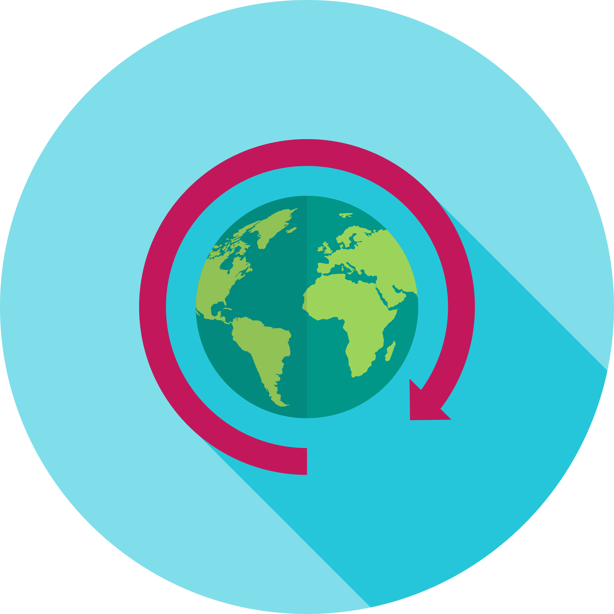

#  A Cloud and React-based Social Network
 Including posting pictures or videos with texts, browsing, and managing personal content.

### Setup: run the following command in the terminal:
```
cd frontend
npm install
npm start
```

### Note:
The backend is deployed on the Google App Engine, linking with the frontend
